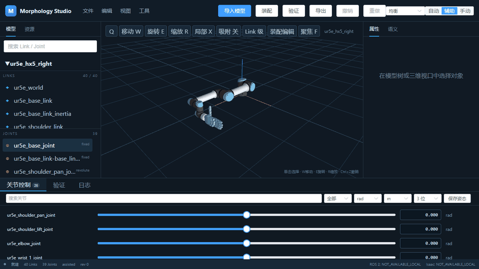
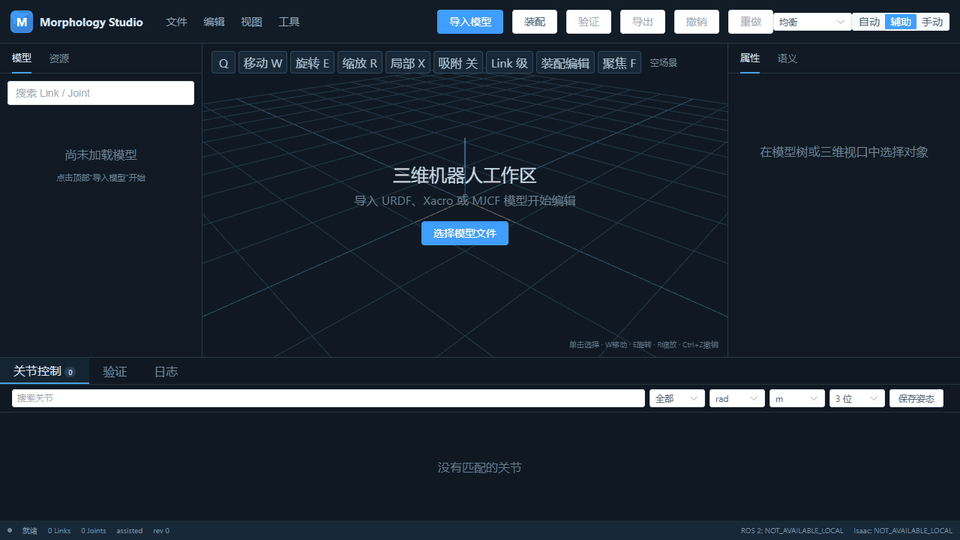

<div align="center">

# Morphology Studio

<p>A source-preserving desktop workspace for inspecting, editing, assembling, validating, and converting robot models.</p>

<p><a href="README.md">English</a> · <a href="README.zh-CN.md">简体中文</a></p>

<p>
  <a href="https://github.com/sichenglil/Morphology_Studio/actions/workflows/backend-ci.yml"></a>
  <a href="https://github.com/sichenglil/Morphology_Studio/actions/workflows/frontend-ci.yml"></a>
  <a href="https://github.com/sichenglil/Morphology_Studio/actions/workflows/e2e.yml"></a>
  <a href="LICENSE"></a>
</p>

<p><strong>Version 0.1.2 · Alpha · ROS-free core · Optional ROS 2 and Isaac integrations planned</strong></p>

<p><a href="#demo">Demo</a> · <a href="#download">Download</a></p>

</div>

<a id="demo"></a>
## Robot operation demo

The animation below records the packaged `ur5e_hx5_right` robot being loaded and operated inside Morphology Studio.

<p align="center"></p>

- The GIF is captured from the real application while loading the model and moving a joint.
- The application and EXE use the copied resources under `assets/robot_models/ur5e_hx5_right`.
- Running the application does not require the original Morphology-Conditioned project.
- Regenerate with `python scripts/render/generate_software_demo_gif.py`.

## UR5e and dexterous-hand assembly

This recording shows the real assembly workflow: import the standalone UR5e model,
select the standalone HX5 dexterous hand as the child model, connect its root to
the UR5e `tool0` link, display the assembled 40-link robot, and export the result.
Local file and output paths are blurred in the recording for privacy.

<p align="center"></p>

Regenerate with `python scripts/render/generate_assembly_demo_gif.py`.

<a id="download"></a>
## Download

Native packages are built on their matching operating systems. Stable assets appear on the
[GitHub Releases page](https://github.com/sichenglil/Morphology_Studio/releases); development builds
are available from the latest successful
[Cross-platform Build and Release run](https://github.com/sichenglil/Morphology_Studio/actions/workflows/build-release.yml).

| Operating system | Architecture | Release package | Runtime notes |
|:--|:--:|:--|:--|
| Windows 10/11 | x64 | [`MorphologyStudio-0.1.0-windows-x64.exe`](https://github.com/sichenglil/Morphology_Studio/releases/latest/download/MorphologyStudio-0.1.0-windows-x64.exe) | Requires Microsoft Edge WebView2 Runtime |
| Linux | x86_64 | [`MorphologyStudio-0.1.0-linux-x86_64.tar.gz`](https://github.com/sichenglil/Morphology_Studio/releases/latest/download/MorphologyStudio-0.1.0-linux-x86_64.tar.gz) | Requires GTK 3 and WebKitGTK 4.1 |
| macOS | Apple Silicon | [`MorphologyStudio-0.1.0-macos-arm64-unsigned.zip`](https://github.com/sichenglil/Morphology_Studio/releases/latest/download/MorphologyStudio-0.1.0-macos-arm64-unsigned.zip) | Unsigned native arm64 application |
| macOS | Intel | [`MorphologyStudio-0.1.0-macos-x64-unsigned.zip`](https://github.com/sichenglil/Morphology_Studio/releases/latest/download/MorphologyStudio-0.1.0-macos-x64-unsigned.zip) | Unsigned native x86_64 application |

> Version `v0.1.0` is published and the direct asset links above are active. Every release includes
> `SHA256SUMS.txt`. Development builds remain available from Actions. Installation details are in
> [the cross-platform guide](docs/cross-platform-packaging.md).

## Package contents and minimum runnable unit

| Platform package | Bundled content | Minimum runnable unit | Files that must stay together |
|:--|:--|:--|:--|
| Windows `.exe` | Python runtime, backend, compiled frontend, OpenCascade WASM/Worker, configuration, licenses, and example resources | **One `MorphologyStudio-0.1.0-windows-x64.exe` file** | None; WebView2 is a Windows runtime dependency |
| Linux `.tar.gz` | `MorphologyStudio/` executable plus bundled Python libraries, frontend, WASM/Worker, configuration, licenses, and resources | **The complete extracted `MorphologyStudio/` directory** | Do not move only `MorphologyStudio/MorphologyStudio`; keep its `_internal/` directory beside it |
| macOS `.zip` | A native `.app` Bundle containing the executable, Python libraries, frontend, WASM/Worker, configuration, licenses, and resources | **The complete `MorphologyStudio.app` Bundle** | Do not extract or copy only `Contents/MacOS/MorphologyStudio` |

The archive itself is a transport/download unit, not always the runtime unit. Windows is genuinely
single-file. Linux is an optimized onedir build to avoid repeated extraction and must retain the full
directory. macOS applications are directory Bundles presented by Finder as one application. User
models, exported URDF files, and logs are external data and are not required merely to start the app.

<a id="overview"></a>
## Overview

Morphology Studio keeps the source model read-only while providing one workspace for model inspection and preparation. It is robot-agnostic: robot names, link names, joint counts, and package layouts are discovered from input data rather than embedded in core logic.

| Source preserving | Robot agnostic | ROS-free workflow |
|:--|:--|:--|
| Edits and generated files stay outside the original model. | Structure and resources are discovered from the input data. | Expand Xacro and build portable packages with explicit package maps. |

<a id="features"></a>
## Feature modules

Each module below states its purpose, main action, input, output, maturity, and detailed guide.

| Module | Purpose and operation | Input → output | Status | Guide |
|:--:|:--|:--|:--:|:--:|
| **Model Import** | Open a file or scan a directory; confirm assisted low-confidence choices. | URDF / Xacro / MJCF / directory → normalized model | Stable / Beta by format | [Import](docs/import_models.md) |
| **Model Tree & Viewport** | Search large hierarchies and inspect resolved primitives and STL/DAE meshes in an interactive Three.js scene. | Normalized model + assets → synchronized tree and 3D selection | Stable | [User guide](docs/user_guide.md) |
| **Joint Control** | Preview motion with sliders or exact signed values, selectable units, precision, and limit feedback. | Joint limits + value → posed robot | Stable | [Joint control](docs/joint_control.md) |
| **Transform Editing** | Move or rotate selected objects with a gizmo or exact XYZ/RPY fields. | Selection + transform → tracked model edit | Beta | [Transforms](docs/transform_editing.md) |
| **Assembly** | Choose parent and child roots and create a generic fixed connection. | Two models + pose → combined model | Beta | [Assembly](docs/assembly.md) |
| **Validation** | Check names, topology, limits, resources, and export readiness. | Current model → actionable errors and warnings | Beta | [Validation](docs/validation.md) |
| **Export & Packaging** | Export to an explicit destination, copy resolved assets, and rewrite references without changing the source. | Model + assets → URDF / MJCF / JSON / portable package | Beta | [Export](docs/export.md) |
| **Workspaces** | Save source references, committed edits, poses, and interface settings. | Session state → workspace YAML | Beta | [Workspaces](docs/workspaces.md) |
| **Desktop Application** | Run the local API and editor inside the platform-native pywebview window. | Packaged app → Windows, Linux, or macOS desktop editor | Beta | [Desktop build](docs/cross-platform-packaging.md) |

<a id="formats"></a>
## Supported formats

| Format | Import | Export | Support | Notes |
|:--:|:--:|:--:|:--:|:--|
| URDF | Yes | Yes | Supported | Core robot model format |
| Xacro | Yes | Expanded URDF | Partial | Explicit package maps work without ROS |
| MJCF | Yes | Yes | Partial | Static structural conversion; review output fidelity |
| STEP | Yes, embedded assisted | URDF / portable package | Experimental | Offline OpenCascade WASM parsing inside the desktop application |
| USD | No | No | Planned | Requires a verified Isaac Sim integration |

<a id="requirements"></a>
## Requirements and verified environments

| Component | Supported range | Currently verified |
|:--:|:--:|:--|
| Python | 3.9–3.13 | CI: 3.9, 3.11, and 3.13 |
| Node.js | 20–24 | CI: Node.js 22 |
| pnpm | 10–11 | CI: pnpm 11 |
| Desktop | Windows / Linux / macOS | Native PyInstaller matrix: WebView2, GTK/WebKitGTK, and WKWebView |
| Browser development | Windows / Linux | Playwright Chromium E2E on Ubuntu |

<a id="quick-start"></a>
## Quick start from source

Morphology Studio is an alpha release. Use the download table for CI-built packages, or use the following steps for source development. The setup script installs the desktop and documentation extras, locked frontend dependencies, and the Playwright browser.

```powershell
git clone https://github.com/sichenglil/Morphology_Studio.git
Set-Location Morphology_Studio
python -m venv .venv
.\.venv\Scripts\Activate.ps1
./scripts/maintenance/setup_dev.ps1
python project/desktop_entry.py
```

Open `assets/robot_models/ur5e_hx5_right/robot.urdf`. Browser development uses `./scripts/maintenance/run_web.ps1` plus `pnpm --dir web/frontend dev` in a second terminal.

Run the complete local verification suite with `./scripts/validation/test_all.ps1`.

## STEP import and URDF export

Select a `.step` or `.stp` file directly in the desktop import dialog. The bundled OpenCascade
WebAssembly worker tessellates solids offline; confirm link names, parent links, joint types and axes
in the same dialog, then load the result into the normal 3D workspace. No separate step2urdf checkout,
Node.js installation or network connection is required at runtime. Validate and preview joints before
choosing URDF, portable directory or portable ZIP export. Detailed behavior and limitations are in
[the STEP workflow](docs/step-workflow.md), with [reference analysis](docs/reference-analysis.md)
and [export structure](docs/urdf-export.md).

STEP bytes remain on the computer and geometry processing runs outside the UI thread. Morphology
Studio does not silently infer mechanism semantics: geometry becomes link candidates, while
parent/child relationships, joint types and axes require confirmation. The bundled OpenCascade WASM
adds about 50 MB to the uncompressed application and very large CAD assemblies remain bounded by
WebView2 memory.

<a id="five-minute-workflow"></a>
## Five-minute workflow

1. Select **Import model** and open the generic two-link example.
2. Select `arm` in the model tree; orbit and focus the 3D viewport.
3. Move the joint slider or type an exact value and press Enter.
4. Use `W` and `E` to switch the transform gizmo between move and rotate.
5. Import `assets/robot_models/ur5e_hx5_right/robot.urdf`, open **Assembly**, and create a fixed joint.
6. Run **Validation**, choose an output destination, and export a portable package.

<a id="architecture"></a>
## Architecture

The Vue/Three.js editor talks to a local FastAPI service. Importers populate one in-memory `RobotModel`; validators, workspaces, and exporters consume that same model, while pywebview supplies only the native window and controlled file selection. See [architecture.md](docs/architecture.md).

<a id="repository-structure"></a>
## Repository structure

| Path | Purpose |
|:--:|:--|
| `.github/` | CI, release automation, issue and pull-request templates |
| `scripts/build/packaging/` | PyInstaller Windows packaging configuration |
| `src/morphology_toolkit/` | Robot-agnostic Python backend and packaged frontend assets |
| `web/frontend/` | Sole editable Vue 3 and Three.js frontend |
| `tests/` | Python unit, integration, documentation, and local acceptance tests |
| `assets/robot_models/ur5e_hx5_right/` | Packaged combined robot model |
| `docs/` | User, architecture, maintainer, audit, and visual documentation |
| `scripts/` | Stable entry scripts plus grouped development and migration helpers |
| `config/` | Application, model registry, and package-map configuration |

Generated output belongs in ignored `build/`, `dist/`, `generated/`, or a user workspace. See [repository_structure.md](docs/repository_structure.md).

<a id="roadmap"></a>
## Roadmap

- **Stable:** strengthen URDF resource diagnostics and large-model regression coverage.
- **Beta:** improve Xacro/MJCF fidelity, assembly ergonomics, and workspace migration.
- **Planned:** optional ROS 2 and Isaac adapters when verified environments are available.

## Contributing, security, and license

Read [CONTRIBUTING.md](docs/governance/CONTRIBUTING.md), report vulnerabilities privately through [SECURITY.md](docs/governance/SECURITY.md), and use the provided issue templates without attaching proprietary models. Morphology Studio is licensed under [Apache-2.0](LICENSE); dependency attribution is recorded in [THIRD_PARTY_NOTICES.md](project/THIRD_PARTY_NOTICES.md).

## Windows single-file release

Build the final onefile edition with `powershell -ExecutionPolicy Bypass -File .\scripts\build_onefile.ps1`.
The only runtime file users must copy is `release\v0.1.2\MorphologyStudio-0.1.2-windows-x64.exe`. It contains Python, the
frontend, OpenCascade WASM/Worker, configuration and the default robot resources. Python, Node.js,
pnpm, OpenCascade and the source tree are not needed; Windows must provide Edge WebView2 Runtime.

PyInstaller onefile extracts native libraries and data to a temporary `_MEI*` directory, so the first
launch can be slower. Logs and caches are stored under `%LOCALAPPDATA%\MorphologyStudio`, never beside
the EXE. The faster onedir build remains available through `scripts\build_onedir.ps1`. See
[packaging](docs/packaging.md) and [measured startup performance](docs/startup-performance.md).
