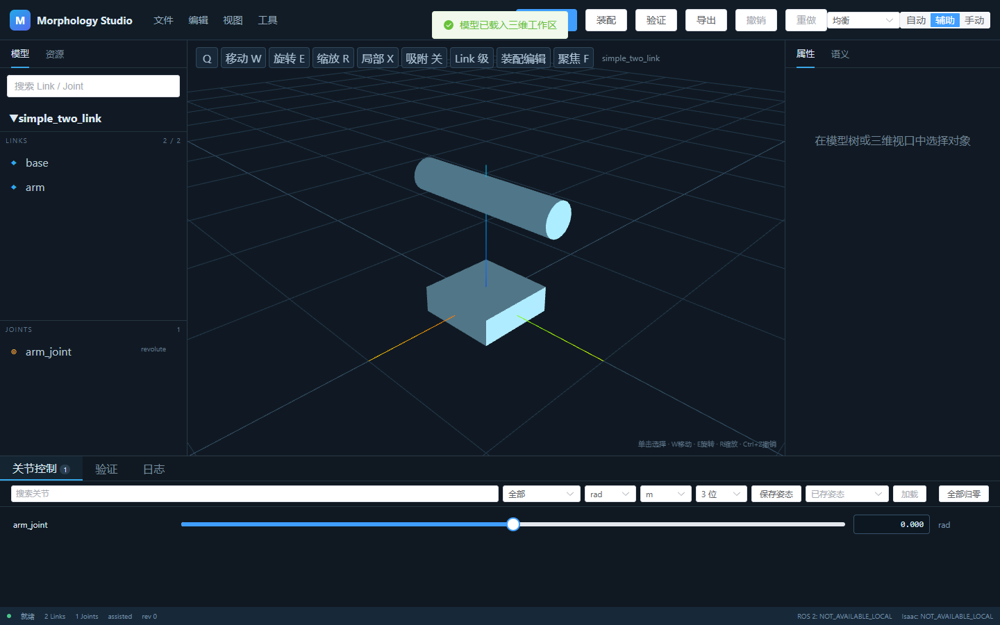
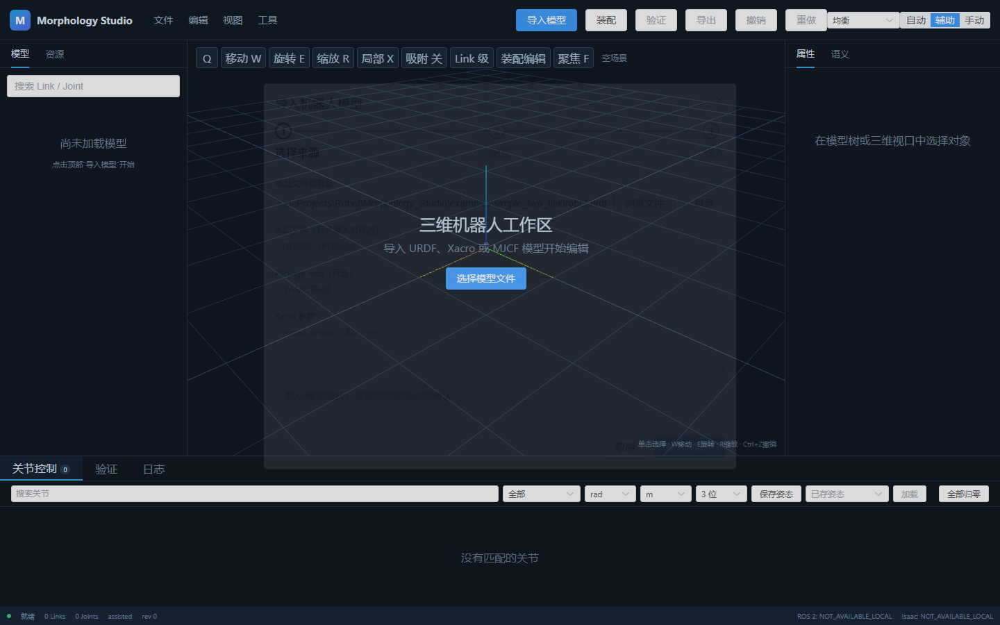
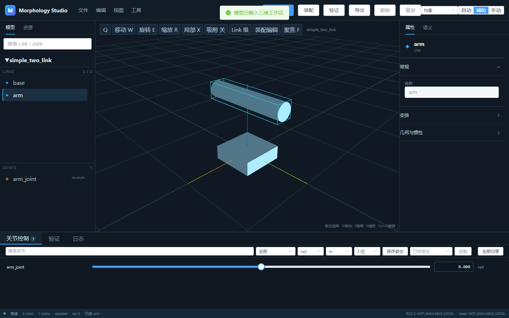
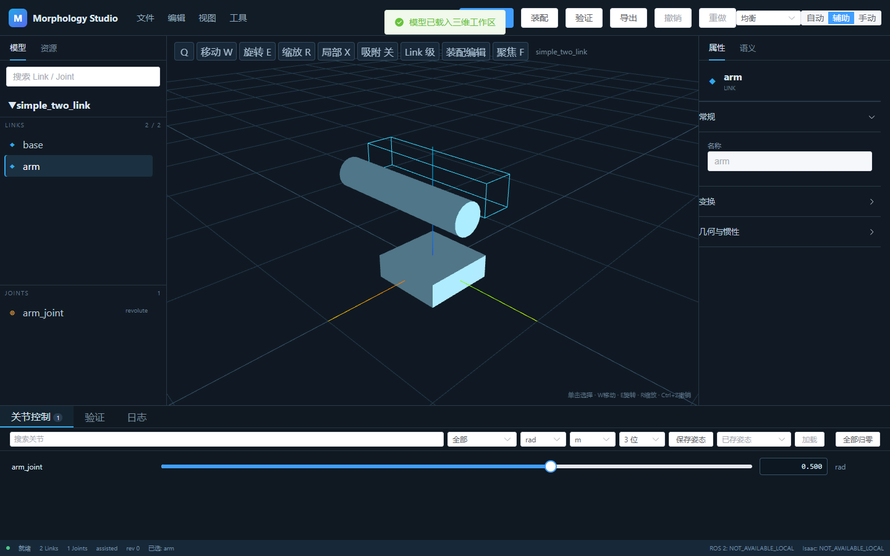
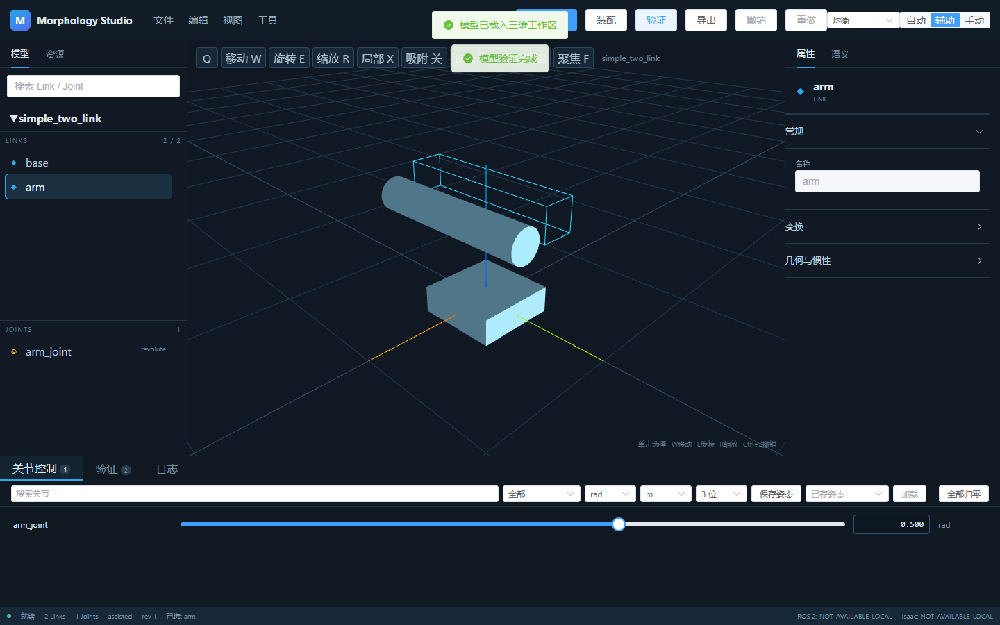
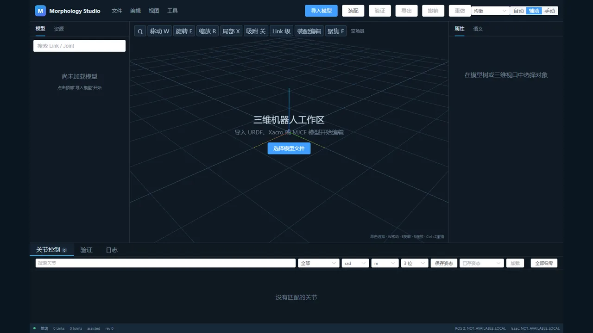

<div align="center">

# Morphology Studio

<p>面向机器人模型检查、编辑、装配、验证与转换的源文件保护型桌面工作区。</p>

<p><a href="README.md">English</a> · <a href="README.zh-CN.md">简体中文</a></p>

<p>
  <a href="https://github.com/sichenglil/Morphology_Studio/actions/workflows/backend-ci.yml"></a>
  <a href="https://github.com/sichenglil/Morphology_Studio/actions/workflows/frontend-ci.yml"></a>
  <a href="https://github.com/sichenglil/Morphology_Studio/actions/workflows/e2e.yml"></a>
  <a href="LICENSE"></a>
</p>



<p><strong>版本 0.1.0 · Alpha · 核心功能无需 ROS · ROS 2 与 Isaac 集成规划中</strong></p>

</div>

<a id="contents"></a><h2 align="center">目录</h2>
<p align="center"><a href="#overview">项目概览</a> · <a href="#features">功能模块</a> · <a href="#formats">格式</a> · <a href="#requirements">运行环境</a> · <a href="#quick-start">快速开始</a> · <a href="#gallery">截图</a> · <a href="#architecture">架构</a> · <a href="#roadmap">路线图</a></p>

<a id="overview"></a><h2 align="center">项目概览</h2>

Morphology Studio 在保持源模型只读的前提下，为检查和准备机器人模型提供统一工作区。核心逻辑不绑定机器人名称、连杆名称、关节数量或固定目录，模型结构均在导入时自动解析。

<table align="center">
<tr>
<td align="center"><strong>保护源文件</strong><br>编辑记录和生成文件始终与原始模型分离。</td>
<td align="center"><strong>与机器人型号无关</strong><br>从输入数据自动识别结构、名称和资源。</td>
<td align="center"><strong>无需 ROS 的工作流</strong><br>通过显式 package map 展开 Xacro 并生成可移植包。</td>
</tr>
</table>

<a id="features"></a><h2 align="center">功能模块</h2>

下表说明每个模块解决的问题、主要操作、输入输出、成熟度及详细文档。

<table align="center"><thead><tr><th align="center">模块</th><th align="left">用途与操作</th><th align="left">输入 → 输出</th><th align="center">状态</th><th align="center">文档</th></tr></thead><tbody>
<tr><td align="center"><strong>模型导入</strong></td><td align="left">打开文件或扫描目录；低置信度选择需要用户确认。</td><td align="left">URDF / Xacro / MJCF / 目录 → 规范化机器人模型</td><td align="center">稳定 / 部分格式测试中</td><td align="center"><a href="docs/import_models.md">导入</a></td></tr>
<tr><td align="center"><strong>模型树与三维视口</strong></td><td align="left">搜索大型层级，并在 Three.js 场景中检查基础几何与已解析的 STL/DAE 网格。</td><td align="left">模型 + 资源 → 同步的模型树与三维选择</td><td align="center">稳定</td><td align="center"><a href="docs/user_guide.md">用户指南</a></td></tr>
<tr><td align="center"><strong>关节控制</strong></td><td align="left">通过滑块或精确数值预览运动，支持单位、精度和限位反馈。</td><td align="left">关节限位 + 数值 → 机器人姿态</td><td align="center">稳定</td><td align="center"><a href="docs/joint_control.md">关节控制</a></td></tr>
<tr><td align="center"><strong>变换编辑</strong></td><td align="left">通过操作柄或 XYZ/RPY 精确字段移动、旋转对象。</td><td align="left">对象 + 变换 → 可追踪的模型修改</td><td align="center">测试中</td><td align="center"><a href="docs/transform_editing.md">变换</a></td></tr>
<tr><td align="center"><strong>模型装配</strong></td><td align="left">选择父子根节点，创建通用 fixed 连接。</td><td align="left">两个模型 + 位姿 → 组合模型</td><td align="center">测试中</td><td align="center"><a href="docs/assembly.md">装配</a></td></tr>
<tr><td align="center"><strong>验证</strong></td><td align="left">检查名称、拓扑、限位、资源和导出就绪状态。</td><td align="left">当前模型 → 可处理的错误和警告</td><td align="center">测试中</td><td align="center"><a href="docs/validation.md">验证</a></td></tr>
<tr><td align="center"><strong>导出与资源打包</strong></td><td align="left">导出到明确位置，复制已解析资源并改写引用，全程不修改源文件。</td><td align="left">模型 + 资源 → URDF / MJCF / JSON / 可移植包</td><td align="center">测试中</td><td align="center"><a href="docs/export.md">导出</a></td></tr>
<tr><td align="center"><strong>工作区</strong></td><td align="left">保存源引用、已提交修改、姿态和界面设置。</td><td align="left">会话状态 → workspace YAML</td><td align="center">测试中</td><td align="center"><a href="docs/workspaces.md">工作区</a></td></tr>
<tr><td align="center"><strong>桌面应用</strong></td><td align="left">在 Windows pywebview 原生窗口中运行本地 API 和编辑器。</td><td align="left">发行包 → Windows 桌面编辑器</td><td align="center">测试中</td><td align="center"><a href="docs/desktop_build.md">桌面构建</a></td></tr>
</tbody></table>

<a id="formats"></a><h2 align="center">支持格式</h2>

<table align="center"><thead><tr><th align="center">格式</th><th align="center">导入</th><th align="center">导出</th><th align="center">支持状态</th><th align="left">说明</th></tr></thead><tbody>
<tr><td align="center">URDF</td><td align="center">是</td><td align="center">是</td><td align="center">已支持</td><td align="left">核心机器人模型格式</td></tr>
<tr><td align="center">Xacro</td><td align="center">是</td><td align="center">展开为 URDF</td><td align="center">部分支持</td><td align="left">显式 package map 可在无 ROS 环境使用</td></tr>
<tr><td align="center">MJCF</td><td align="center">是</td><td align="center">是</td><td align="center">部分支持</td><td align="left">静态结构转换，建议检查输出保真度</td></tr>
<tr><td align="center">STEP</td><td align="center">需要适配器</td><td align="center">否</td><td align="center">实验性</td><td align="left">需要单独安装 step2urdf 适配器</td></tr>
<tr><td align="center">USD</td><td align="center">否</td><td align="center">否</td><td align="center">规划中</td><td align="left">需要经过验证的 Isaac Sim 集成</td></tr>
</tbody></table>

<a id="requirements"></a><h2 align="center">运行要求与验证环境</h2>

<table align="center"><thead><tr><th align="center">组件</th><th align="center">支持范围</th><th align="left">当前验证环境</th></tr></thead><tbody>
<tr><td align="center">Python</td><td align="center">3.9–3.13</td><td align="left">CI：3.9、3.11、3.13</td></tr>
<tr><td align="center">Node.js</td><td align="center">20–24</td><td align="left">CI：Node.js 22</td></tr>
<tr><td align="center">pnpm</td><td align="center">10–11</td><td align="left">CI：pnpm 11</td></tr>
<tr><td align="center">桌面应用</td><td align="center">Windows</td><td align="left">Windows pywebview 与 PyInstaller 构建流程</td></tr>
<tr><td align="center">浏览器开发</td><td align="center">Windows / Linux</td><td align="left">Ubuntu 上的 Playwright Chromium 端到端测试</td></tr>
</tbody></table>

<a id="quick-start"></a><h2 align="center">从源码快速开始</h2>

Morphology Studio 当前以 Alpha 源码版本发布，尚未提供预编译安装包。安装脚本会安装桌面与文档依赖、锁定的前端依赖和 Playwright 浏览器。

```powershell
git clone https://github.com/sichenglil/Morphology_Studio.git
Set-Location Morphology_Studio
python -m venv .venv
.\.venv\Scripts\Activate.ps1
./scripts/setup_dev.ps1
python desktop_entry.py
```

首次导入 `examples/simple_two_link/robot.urdf`。浏览器开发模式运行 `./scripts/run_web.ps1`，并在第二个终端运行 `pnpm --dir web/frontend dev`。

使用 `./scripts/test_all.ps1` 运行完整本地验收。

<a id="five-minute-workflow"></a><h2 align="center">五分钟使用流程</h2>

1. 点击“导入模型”，打开通用两连杆示例。
2. 在模型树选择 `arm`，旋转视口并聚焦对象。
3. 拖动关节滑块，或输入精确值并按 Enter。
4. 使用 `W`/`E` 切换移动和旋转操作柄。
5. 导入 `examples/simple_tool/tool.urdf`，通过“装配”创建 fixed 连接。
6. 运行“验证”，选择输出位置并导出可移植资源包。

<a id="gallery"></a><h2 align="center">截图画廊</h2>

<table align="center"><tr><td align="center"><br><strong>导入</strong></td><td align="center"><br><strong>选择与检查</strong></td></tr><tr><td align="center"><br><strong>关节控制</strong></td><td align="center"><br><strong>验证</strong></td></tr></table>

<p align="center"></p>

<a id="architecture"></a><h2 align="center">架构</h2>

Vue/Three.js 编辑器通过本地 HTTP 调用 FastAPI。导入器写入唯一的内存 `RobotModel`，验证、工作区和导出器共享该模型；pywebview 仅提供原生窗口和受控文件选择。详见 [architecture.md](docs/architecture.md)。

<a id="repository-structure"></a><h2 align="center">项目结构</h2>

| 路径 | 用途 |
|:--:|:--:|
| `.github/` | CI、发布流程、Issue 与 PR 模板 |
| `packaging/windows/` | Windows PyInstaller 打包配置 |
| `src/morphology_toolkit/` | 通用 Python 后端和发行版前端资源 |
| `web/frontend/` | 唯一可编辑 Vue 3 / Three.js 前端 |
| `tests/` | Python 单元、集成、文档和本地验收测试 |
| `examples/` | 小型 Apache-2.0 通用 URDF 示例 |
| `docs/` | 用户、架构、维护、审计和视觉文档 |
| `scripts/` | 稳定入口以及分组后的开发和迁移工具 |
| `configs/` | 可选 package map 与验收配置 |

生成内容只能进入已忽略的 `build/`、`dist/`、`generated/` 或用户工作区。详细结构见 [repository_structure.md](docs/repository_structure.md)。

<a id="roadmap"></a><h2 align="center">路线图</h2>

- **Stable：**加强 URDF 资源诊断和大型模型回归测试。
- **Beta：**提升 Xacro/MJCF 保真度、装配体验和工作区迁移。
- **Planned：**在具备可验证环境后增加可选 ROS 2 与 Isaac 适配器。

<h2 align="center">贡献、安全与许可证</h2>

贡献前阅读 [CONTRIBUTING.md](CONTRIBUTING.md)，漏洞按 [SECURITY.md](SECURITY.md) 私下报告，提交 Issue 时不要附带专有模型。本项目采用 [Apache-2.0](LICENSE)，依赖与致谢见 [THIRD_PARTY_NOTICES.md](THIRD_PARTY_NOTICES.md)。
