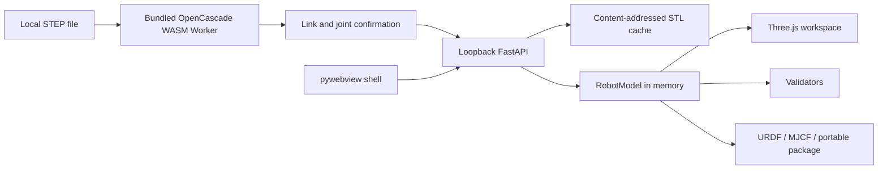

# Architecture

## Embedded STEP boundary

The desktop frontend bundles OpenCascade.js and loads it only when a `.step` or `.stp` file is
parsed. Tessellation runs in a Web Worker, so the Vue UI remains responsive. The worker returns typed
triangle buffers; the import wizard converts each confirmed solid to binary STL and sends it to the
loopback FastAPI service. The backend validates STL sizes, stores meshes in a content-addressed user
cache and creates the canonical `RobotModel`. STEP coordinates are millimetres and mesh scale is
recorded as `0.001` for URDF metres.

`RobotModel` remains the only editable source of truth. OpenCascade objects never cross the Worker
boundary and are released after parsing. The old external-editor launcher is removed; existing URDF
ZIP packages exported by step2urdf remain import-compatible.

CAD topology cannot reliably determine robot semantics. The wizard therefore defaults additional
solids to fixed children of the first solid and requires users to review names, parent relationships,
joint type and axis before import.
