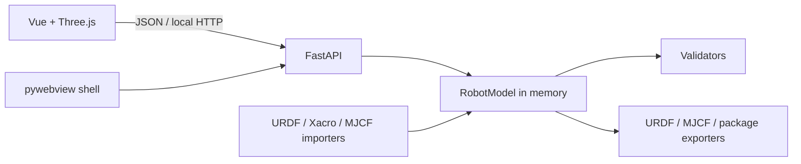

# Architecture

`RobotModel` is the source of truth. Importers normalize external formats, the API exposes controlled operations, and the renderer maintains a runtime index for incremental updates. File selection is isolated in the desktop bridge; no arbitrary command bridge exists.
