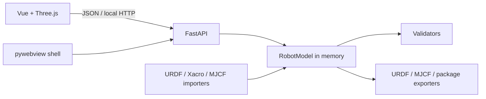

# Architecture

## Optional STEP boundary

Raw STEP topology is handled by the separately installed step2urdf browser worker. Morphology Studio
discovers and launches that editor but does not share transient Three.js/OpenCascade objects with it.
The stable boundary is a URDF ZIP: the backend validates archive paths, extracts into a
content-addressed user cache, imports the URDF into the canonical `RobotModel`, and resolves meshes
relative to the extracted URDF. This keeps STEP parsing off the desktop UI thread and preserves one
model source of truth for editing, validation, workspace persistence and export.

`RobotModel` is the source of truth. Importers normalize external formats, the API exposes controlled operations, and the renderer maintains a runtime index for incremental updates. File selection is isolated in the desktop bridge; no arbitrary command bridge exists.
