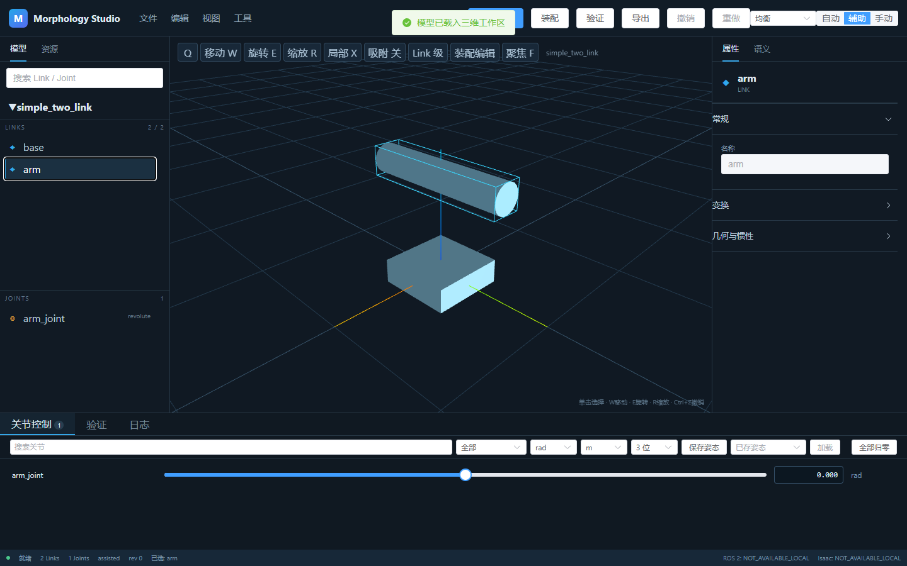
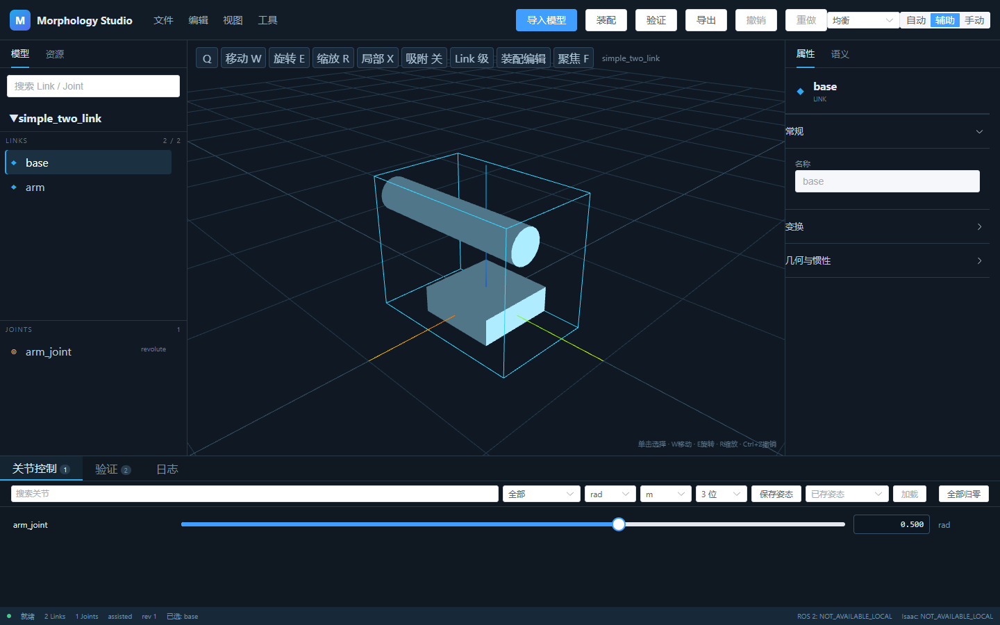
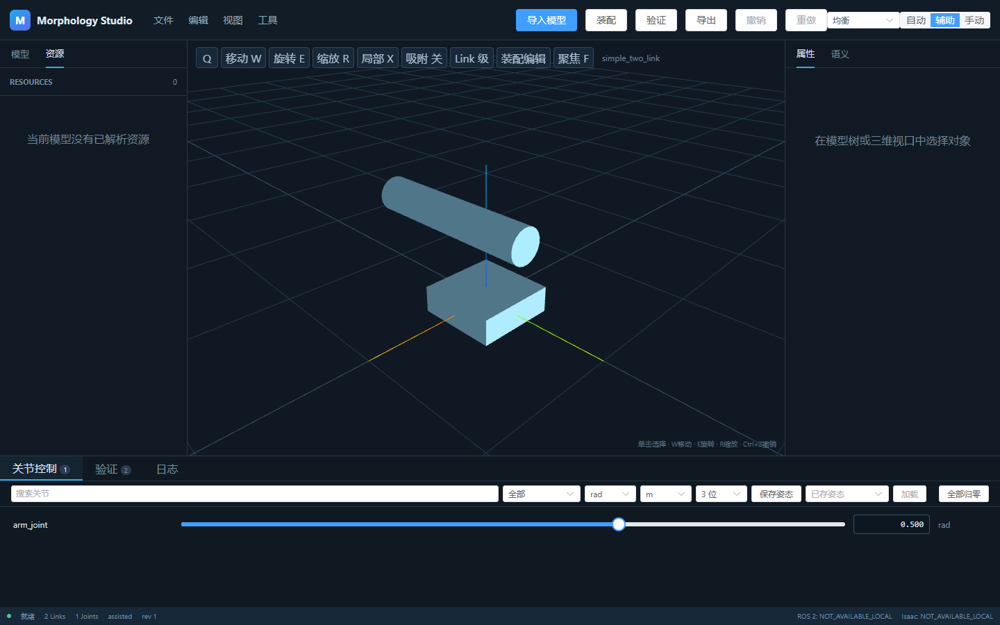
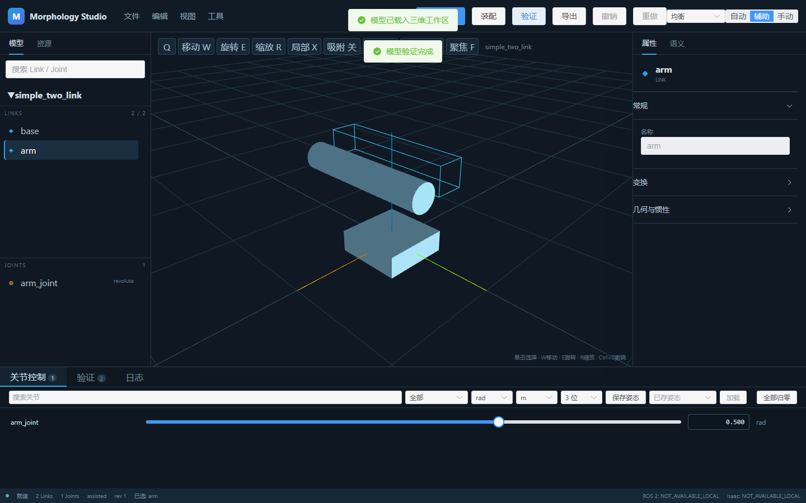
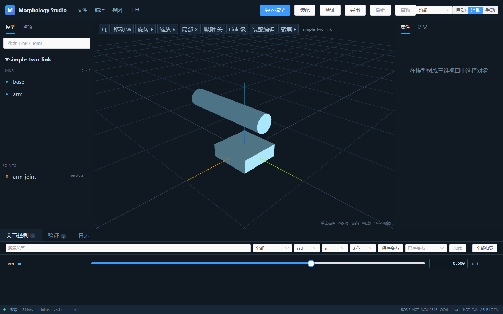

# Visual tutorial

All images below were captured by Playwright from the current application using `examples/simple_two_link/robot.urdf`.

1. Open the generic model in the import dialog. 
2. Confirm the model tree and 3D geometry. 
3. Select the arm link. 
4. Switch to the rotate gizmo. 
5. Enter an exact joint value. 
6. Inspect the exact transform. 
7. Browse resolved resources. 
8. Open the assembly workflow. 
9. Run validation. 
10. Choose an export format and destination. 

The short [animated workflow](assets/demo/workflow.webp) is generated from the same capture sequence.
